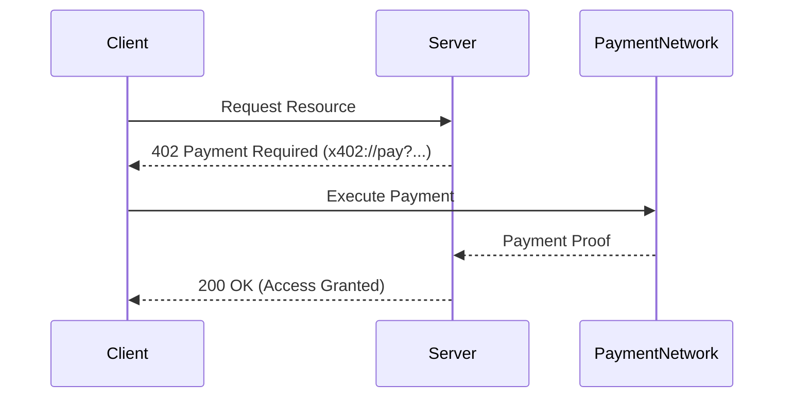

# X402 Payment Protocol Documentation

## Introduction
The **X402 Payment Protocol** is a decentralized, trust-minimized protocol that enables machine-to-machine (M2M) and agent-to-agent payments through standardized HTTP responses. It extends the traditional HTTP `402 Payment Required` status code to provide a programmable, interoperable, and chain-agnostic way for digital agents and services to negotiate and settle payments automatically.

## Core Concept
The 402 HTTP status code was reserved for “Payment Required,” but was never standardized — until now.  
The **X402 Protocol** defines how agents can interact programmatically when a payment is required before accessing a service or resource.

Example:
```
HTTP/1.1 402 Payment Required
Payment-Request: x402://pay?amount=2.5&currency=USDC&chain=any&receiver=agent.xyz
```

This allows autonomous clients to detect the request, fulfill it using their wallet or payment module, and retry the operation once confirmed.

---

## How It Works

### 1. Request Access
An agent (client) sends an HTTP request to a protected resource.

```
GET /data/insights HTTP/1.1
Host: api.agentnet.io
```

### 2. Receive Payment Challenge
The server responds with a `402 Payment Required` message, describing the payment conditions in the header or JSON body.

```
HTTP/1.1 402 Payment Required
Content-Type: application/json

{
  "amount": "2.5",
  "currency": "USDC",
  "chain": "any",
  "receiver": "agent.xyz",
  "payment_url": "x402://pay?session=abc123"
}
```

### 3. Client Executes Payment
The client uses its internal payment engine or wallet to fulfill the `x402://` request.

### 4. Server Confirms and Grants Access
After verifying payment, the server grants access.

```
HTTP/1.1 200 OK
Content-Type: application/json

{
  "status": "success",
  "message": "Access granted"
}
```

---

## Key Features

- ✅ **Chain Agnostic:** Works across Ethereum, Hedera, Solana, etc.
- 🔒 **Trustless:** Uses verifiable payment proofs.
- 🤝 **Interoperable:** Works with any web service or AI agent.
- ⚙️ **Extensible:** Can integrate with identity, reputation, or escrow systems.

---

## API Specification

| Method | Endpoint | Description |
|--------|-----------|-------------|
| `GET` | `/resource` | Access a protected resource. Returns `402` if payment required. |
| `POST` | `/x402/pay` | Endpoint for payment verification callback. |
| `GET` | `/x402/status/:tx` | Verify the payment status. |

### Example: Payment Flow


---

## Example Implementation

### Client Side
```js
async function fetchProtectedResource() {
  const res = await fetch("https://api.agentnet.io/data");
  if (res.status === 402) {
    const details = await res.json();
    await pay(details.payment_url); // Handle x402://
    return fetch("https://api.agentnet.io/data"); // Retry after payment
  }
  return res.json();
}
```

### Server Side (Node.js)
```js
app.get("/data", async (req, res) => {
  const paid = await verifyPayment(req);
  if (!paid) {
    return res.status(402).json({
      amount: "2.5",
      currency: "USDC",
      chain: "any",
      receiver: "agent.xyz",
      payment_url: "x402://pay?session=abc123"
    });
  }
  res.json({ data: "Here is your premium data" });
});
```

---

## Implementation Notes

- The `x402://` URI scheme can point to an internal wallet, smart contract, or payment API.
- Payment proofs should be signed and verifiable by both parties.
- Integration with decentralized identity (DID) and reputation networks can enhance trust.

---

## Example Use Cases

| Category | Example |
|-----------|----------|
| **AI Agents** | Agent A pays Agent B for data or compute services. |
| **API Providers** | Monetize API calls per request. |
| **IoT Devices** | IoT sensors stream paid data. |
| **DeFi dApps** | Micropayments for oracle or data feeds. |

---

## Security & Compliance

- Always verify payment proofs before granting access.  
- Use signed metadata to avoid spoofing.  
- Consider rate-limiting and replay protection.  

---

## Future Extensions

- Integration with ERC-8004 and related agent standards.  
- Support for subscription and recurring payments.  
- Privacy-preserving zero-knowledge payment proofs.  

---

**Author:** X402 Community  
**Version:** 1.0 (Draft)  
**License:** MIT  
